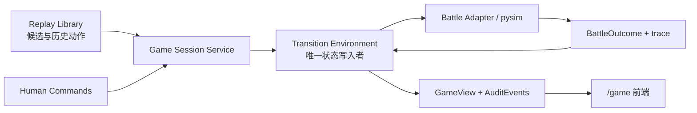

# Transition 前后端审计游戏任务书

> 本文是 [`transition实现任务书.md`](transition实现任务书.md) 的下游施工书。
> 前者负责把结构化 state、action、battle outcome 和连续 environment 做正确；本文负责
> 在这些接口稳定后，建立一个由 transition 掌管唯一真状态的本地前后端游戏，让人类
> 接管回放中的一方、让另一方继续执行历史策略，并逐动作、逐回合审查 transition。
>
> 本文中的复选框是实施状态，不是当前仓库状态。只有对应代码、测试和验收产物已经
> 落地后才能勾选。

## 0. 最终要交付什么

最终交付一个本地单用户页面：

```text
http://127.0.0.1:8300/game
```

用户可以：

1. 从 Normal 1v1 回放库中选择一局至少有 5 个有效回合的对局；
2. 指定其中一名玩家作为“历史策略对手”，自己接管另一名玩家；
3. 从 round 0 开始选择开局，随后自由买兵、布阵、升级、解锁、购买科技、强化
   核心塔、购买塔技能和蓝图；
4. 每回合从该回放真实出现的 4 张增援候选中自由选择一张；
5. 结束部署后，让对手执行同回合的历史 action plan，再由 pysim 进行战斗；
6. 查看每个 action receipt、资金账本、state diff、不变量、pysim 扣血与经验结算；
7. 一直运行到 pysim 判定终局、历史动作耗尽，或碰到明确报告的 unsupported 机制。

这不是普通的回放播放器，也不是现有无限资源沙盒的换皮。它的核心证明目标是：

```text
round 0 rules + replay external offers + human actions + opponent replay actions
    -> transition 累积状态
    -> pysim BattleOutcome
    -> settlement / next round
```

除开局/增援候选和对手历史 action 外，后续状态不得由回放快照回灌。

### 0.1 最终验收场景

至少选择一条 capability scanner 判定为可连续运行 5 回合的仓库 fixture，完成：

1. 人类在 round 0 选择一个与原玩家历史选择不同的开局；
2. round 1 自由执行至少一次购买、移动和结束部署；
3. round 2 从回放的 4 张增援牌中选择一个与原玩家不同的候选；
4. 后续至少执行一次单位升级或科技购买，以及一次塔强化、塔技能或蓝图操作；
5. 对手始终执行自己的历史 action plan；
6. 至少连续结算到 round 5，或者由 pysim 提前把一方 HP 扣到 0；
7. 全程没有负资金、重复 entity ID、phase 跳转、silent ignore 或未来快照覆盖。

若 fixture 因 pysim 提前终局，另补一条固定 seed 下能运行满 5 回合的 fixture 作为
连续性 Gate。

## 1. 已确认的产品决定

以下决定已经冻结，实施时不要重新发明另一套产品语义。

### 1.1 人类与对手

- 人类自由执行 transition 当前支持的合法操作，不要求贴近原玩家动作；
- UI 可以在审计面板展示原玩家同回合动作，但只作对照，不参与状态更新；
- 对手使用所选玩家的历史动作，经 raw adapter 和 canonicalizer 后交给同一个
  transition API；
- 对手每次执行历史 `UpgradeUnit` 前，harness 为目标单位显式补到本级升级门槛，
  保证 pysim 经验偏差不会使历史升级失效；
- 经验补足必须成为 `opponent_exp_override` 审计事件，不能藏在升级函数内部；
- 除经验外，对手的资源、单位引用、科技、塔、蓝图或 phase 出错时必须 strict
  阻塞，不能自动跳过，也不能读取下一回合快照修补。

### 1.2 开局

- 游戏从 round 0 开始，不允许默认从 round 1 快照接管；
- 原始回放只记录最终 `ChooseAdvanceTeam {Index, ID}`，没有保存另外三个未选候选；
- 每个玩家的历史选项放回原 `Index`，来源标记为 `replay_recorded`；
- 另外三个选项由版本化 `opening_offer_generator_v1` 确定性生成，来源标记为
  `generated_v1`；
- 对手自动选择自己的历史项；人类在自己的 4 个候选中自由选择；
- round 1 快照只作为 oracle 校验 expected，不可作为 session state 来源。

生成候选不宣称复刻了原游戏当时未被记录的三个选项。UI 必须显示来源徽标。

### 1.3 增援

- round 2 起使用所选回放 `MatchSnapshotData.reinforceItems` 中的 4 个候选 ID；
- 候选不由新 RNG 或全局牌池生成；
- 人类从 4 张候选中选择一张，不提供弃选分支；
- 对手按该回合历史 `ChooseReinforceItem` 的 ID/Index 选择；
- 双方都正常扣费并应用完整效果；
- 一张候选只要缺少费用或 effect handler，该回合就不能计入可玩前缀；
- 不允许只扣钱、只记录 ID 或只显示描述后把该卡标成 supported。

### 1.4 Tower、蓝图与 review

第一版 tower 范围同时包括：

- `StrengthenTower`：两座核心塔的强化等级；
- `ActiveEnergyTowerSkill`：能量塔技能；
- `ActiveBlueprint`：研究中心/蓝图效果。

review 只在当前页面实时查看：不做登录、数据库、人工正确/错误标签、备注、复现包或
跨进程恢复。服务重启后 session 消失。

## 2. 三层架构与所有权



### 2.1 Transition 层

负责：

- phase、state、合法性和 action 执行；
- 资金、单位、科技、专家、增援、装备、tower、技能和蓝图状态；
- battle input、BattleOutcome、HP/经验/reward settlement；
- digest、diff、不变量和 reason code。

它不读取 FastAPI request、浏览器 session 或回放文件路径。

### 2.2 Game Session 层

负责：

- 回放库、对手选择、外生候选注入；
- 将人类 command 翻译为 typed action；
- canonicalize 对手历史 plan；
- 对手经验 override；
- action undo checkpoint；
- 内存 session、并发版本和 `GameView`；
- 把 transition receipts、diff、outcome 和 trace 组织成 API 响应。

它不能直接改 `EnvironmentState` 字段。任何改变都必须调用 transition 或显式、可审计
的 external event API。

### 2.3 前端层

负责：

- 回放/对手选择、棋盘交互和合法操作入口；
- 展示服务器返回的权威 state；
- 播放 battle trace；
- 展示 receipts、账本、diff 和停止原因。

前端不能自己扣钱、升级、分配 entity ID 或把拖动后的本地坐标直接当作真状态。每次
交互都提交 command，并使用服务器返回的新 `GameView` 重绘。

## 3. Phase 与一局游戏的精确流程

新增/冻结以下 phase：

```python
class Phase(str, Enum):
    OPENING = "opening"
    REINFORCEMENT = "reinforcement"
    DEPLOYMENT = "deployment"
    PRE_BATTLE = "pre_battle"
    ROUND_RESULT = "round_result"
    TERMINAL = "terminal"
    BLOCKED = "blocked"
```

### 3.1 创建 session

`POST /api/game/sessions`：

1. 用 manifest 中的 opaque `replay_id` 解析 shard，客户端不能传本地文件路径；
2. 检查 Normal 1v1、总有效回合数 ≥ 5、`playable_through_round ≥ 5`；
3. 指定 `opponent_player`，另一方成为 human player；
4. 创建空的 round 0 `EnvironmentState`；
5. 构造双方各 4 个 `OpeningOffer`；
6. session 进入 `OPENING`，返回 version 0 的 `GameView`。

### 3.2 执行 opening

人类提交 `CHOOSE_OPENING` 后：

1. 校验 offer index 属于人类当前 opening offers；
2. 对手选择历史 `ChooseAdvanceTeam.Index`；
3. 在临时 state 中原子执行双方 opening choice；
4. 生成专家、初始单位、建筑、初始/最大 HP、初始经济修正和 stable entity ID；
5. 运行 round 1 的 round tick/收入规则；
6. 进入 `DEPLOYMENT`；
7. round 1 replay snapshot 只用于 audit diff，不参与第 4–6 步。

### 3.3 回合开始与增援

- round 1 没有普通增援，直接进入 `DEPLOYMENT`；
- round ≥ 2 时先进入 `REINFORCEMENT`；
- 人类提交 `CHOOSE_REINFORCEMENT` 后，session 同时执行对手历史选择；
- 双方选择必须在同一临时 state 中全部成功才提交；
- 选择完成后执行候选效果并进入 `DEPLOYMENT`。

### 3.4 人类部署

- 每个 typed action 独立提交并立刻返回 receipt；
- accepted action 进入 human undo stack；
- rejected action 返回稳定 reason code，state 和 session version 均不改变；
- `UNDO_LAST_HUMAN_ACTION` 只恢复本回合最后一个 accepted human action 的 checkpoint；
- undo 不跨 reinforcement/opening/battle，也不撤销对手或 settlement。

### 3.5 结束部署、对手历史计划与战斗

人类提交 `FINISH_DEPLOYMENT` 后：

1. 在正式 state 上接受人类的 `FinishDeploy`；
2. clone 当前 state，作为对手 plan 的临时执行目标；
3. canonicalize 本回合对手 raw actions，包括 Buy/Move 引用、Undo、Cancel 和最终
   `FinishDeploy`；
4. 每遇到 `UpgradeUnit`，先在临时 state 写一个审计可见的经验 override event；
5. 逐原子 action strict 执行，保存 receipts；
6. 若任一 action 失败，不提交临时 state，session 进入 `BLOCKED`；
7. 全部成功后提交临时 state，进入 `PRE_BATTLE`；
8. 只调用一次 battle adapter/pysim；
9. 用同一个 `BattleOutcome` 完成 HP、经验、战果和 reward settlement；
10. 进入 `ROUND_RESULT`，返回 outcome、trace 和 audit diff。

### 3.6 下一回合与停止

用户看完战斗后提交 `ACK_ROUND_RESULT`：

- 若任一方 HP ≤ 0，进入 `TERMINAL`；
- 若没有下一回合历史 plan，进入 `TERMINAL`，原因是 `REPLAY_EXHAUSTED`；
- 否则执行 round +1、收入、CD 和到期效果；
- 注入该回合 replay reinforcement offers；
- 有 offers 时进入 `REINFORCEMENT`，无 offers 时进入 `DEPLOYMENT`。

终局或 blocked 后，除读取和删除 session 外，所有 command 都必须稳定拒绝。

## 4. 必须新增或扩展的公共契约

字段名一旦进入 fixture、API 或前端就必须随 `schema_version` 版本化。

### 4.1 Replay library

```python
@dataclass(frozen=True)
class ReplayOpponentOption:
    replay_id: str
    replay_hash: str
    game_version: str
    file_label: str
    opponent_player: int
    opponent_name: str
    human_player: int
    human_name: str
    round_count: int
    playable_through_round: int
    blockers: tuple[CapabilityBlocker, ...]
```

`blockers` 至少区分：

```text
UNSUPPORTED_OPENING
MISSING_REINFORCEMENT_OFFERS
UNSUPPORTED_REINFORCEMENT
MISSING_REINFORCEMENT_EFFECT
UNSUPPORTED_RAW_ACTION
UNSUPPORTED_ACTION_FIELD
MISSING_RULE_DATA
MALFORMED_REPLAY_REFERENCE
```

同一局生成两个 `ReplayOpponentOption`。列表展示所有 round_count ≥ 5 的 option；
`playable_through_round < 5` 的 option 显示为 disabled，并列出第一个 blocker。

### 4.2 Opening 与 reinforcement offer

```python
@dataclass(frozen=True)
class OpeningOffer:
    index: int
    offer_id: str
    name: str
    specialist_id: int
    formation_id: int
    units: tuple[GrantedUnit, ...]
    constructions: tuple[ConstructionPlacement, ...]
    hp_delta: int
    supply_delta: int
    source: str                 # replay_recorded | generated_v1
    ruleset_version: str

@dataclass(frozen=True)
class ReinforcementOffer:
    index: int
    card_id: int
    name: str
    category: str
    level: int
    cost: int
    description: str
    supported: bool
    unsupported_reason: str | None
```

opening recorded option 的完整定义由离线 catalog 构建阶段从大量
`ChooseAdvanceTeam -> round 1 snapshot` 证据归纳；session 运行时只读取 catalog，
不读取当前局的 round 1 state 来构造结果。

### 4.3 Game command

```python
@dataclass(frozen=True)
class GameCommand:
    expected_version: int
    kind: str
    payload: dict
```

冻结以下 command kind：

```text
CHOOSE_OPENING
CHOOSE_REINFORCEMENT
APPLY_ACTION
UNDO_LAST_HUMAN_ACTION
FINISH_DEPLOYMENT
ACK_ROUND_RESULT
```

`APPLY_ACTION` 的 payload 是 transition 公共 `CanonicalAction` JSON，不另造一套 Web
专用 action 语义。单位引用只允许 observation handle 或本 plan 的 `new_ref`。

### 4.4 GameView

```python
@dataclass(frozen=True)
class GameView:
    session_id: str
    version: int
    phase: Phase
    round: int
    replay: ReplaySummary
    human_player: int
    opponent_player: int
    players: tuple[PublicPlayerView, PublicPlayerView]
    opening_offers: tuple[OpeningOffer, ...]
    reinforcement_offers: tuple[ReinforcementOffer, ...]
    legal_actions: LegalActionView
    human_receipts: tuple[ActionReceipt, ...]
    opponent_receipts: tuple[ActionReceipt, ...]
    ledger: tuple[SupplyEntry, ...]
    audit_events: tuple[AuditEvent, ...]
    state_digest: str
    state_diff: tuple[StateDiffEntry, ...]
    historical_actions: tuple[RawActionSummary, ...]
    battle: BattleView | None
    stop_reason: str | None
```

`PublicPlayerView` 可以向审计 UI 展示双方公开棋盘，但不能暴露 env RNG、内部 stable
entity ID 或客户端可伪造的 resource setters。

### 4.5 Audit event

至少支持：

```text
OPENING_OFFER_INJECTED
REINFORCEMENT_OFFERS_INJECTED
REPLAY_ACTION_CANONICALIZED
OPPONENT_EXP_OVERRIDE
ACTION_ACCEPTED
ACTION_REJECTED
BATTLE_STARTED
BATTLE_SETTLED
ROUND_ADVANCED
SESSION_BLOCKED
SESSION_TERMINAL
```

每条 event 记录 session version、round、player、action index、changed paths、前后 digest
和必要的 reason/context，但不保存到数据库。

## 5. 回放与规则数据任务

### G0：冻结基线

**目标**：明确本任务开始前 transition 和现有 Web 的可用能力。

- [ ] 记录 `pytest tests -q` 基线；
- [ ] 记录现有 `/api/simulate`、`/api/replays`、`/api/replay/{idx}/{round}` 响应；
- [ ] 确认 transition 的 schema/ruleset/engine version；
- [ ] 确认 BattleOutcome 已提供扣血、逐 entity 经验和 trace；
- [ ] 把本文加入 transition、RL roadmap 和 README 的文档入口。

**完成 Gate**：旧沙盒和 benchmark 行为有回归保护；transition 未通过自己的 T0–T11
Gate 时，本任务不得用 Web mock 状态绕过它。

### G1：保留每回合增援候选

**目标**：修复当前 `tools/replay2json.py` 丢弃 `reinforceItems` 的问题。

- [ ] 在 `MatchSnapshotData` 中解析 `reinforceItems/ArrayOfInt/int`；
- [ ] 输出规范 `reinforcementOffers: [id0, id1, id2, id3]`；
- [ ] round 0/1 的空列表保持空，不猜默认；
- [ ] 将 action 中的 `ChooseReinforceItem.ID/Index` 与候选对齐；
- [ ] ID/Index 不一致时记录 schema error，不自动按 ID 搜索后改 Index；
- [ ] 保存回放版本、system seed、player seed 和 source hash；
- [ ] 为仓库小样例重新生成含 offers 的 fixture；
- [ ] 对本地全量语料输出候选缺失、长度异常、选择不在候选中的统计。

**完成 Gate**：仓库 fixture 每个 round ≥ 2 的 4 个候选和原始 `.grbr` exact；历史
选择能唯一落到一个候选 index。

### G2：回放 manifest 与单局 shard

**目标**：服务器不在启动时加载几百 MB 的 monolithic JSON。

建议产物：

```text
local_data/replay_game/
  manifest.json
  games/<opaque-replay-id>.json

data/samples/replay_game/
  manifest.json
  games/<fixture-id>.json
```

- [ ] 新增构建工具，把 monolithic rounds 或原始 `.grbr` 转成单局 shard；
- [ ] opaque replay ID 使用内容 hash/稳定编号，不暴露绝对路径；
- [ ] manifest 只放列表所需元数据、能力结果和 shard 相对路径；
- [ ] server 启动只加载 manifest，创建 session 时才加载一个 shard；
- [ ] manifest/shard 写 `schema_version`、`ruleset_version` 和 source hash；
- [ ] 本地大语料保持 gitignored，仓库只提交小 fixture；
- [ ] 原有 `rounds_new11.json -> rounds.json -> samples` 回落链保持兼容。

**完成 Gate**：1106 局规模下，列表接口不需要把完整语料留在进程内存；删除或损坏一个
shard 只影响该 replay option，并返回稳定 blocker。

### G3：opening catalog 与 generator

**目标**：从空 round 0 真正生成 round 1，而不是读取 round 1 state。

- [ ] 冻结 29 种起始兵种组合与 formation ID；
- [ ] 冻结开局专家 ID、名称、HP/经济/解锁/科技/定时增援效果；
- [ ] 冻结初始三种建筑及合法布局；
- [ ] 从全量回放建立 `ChooseAdvanceTeam.ID + specialist + version -> package` 证据表；
- [ ] 对每个 recorded package 保存代表 fixture 与 oracle diff；
- [ ] `opening_offer_generator_v1` 使用稳定 seed：
  `hash(ruleset_version, systemSeed, playerSeed, replay_id, player_index)`；
- [ ] 在 4 个 slot 中保留历史 recorded candidate 及原 Index；
- [ ] 从 catalog 无放回生成其余 3 项，避免重复 specialist/package；
- [ ] generated candidate 明确标记 simulator-generated；
- [ ] catalog 不完整时 option 标记 `UNSUPPORTED_OPENING`。

**完成 Gate**：选择 recorded candidate 时，transition 生成的 round 1 modeled 字段与
oracle exact；同 seed 的三个 generated candidate 顺序和内容完全复现。

### G4：reinforcement effect registry

**目标**：候选卡是否可选由真实效果覆盖决定。

effect registry 至少区分：

| 类别 | state 变化 | battle 入口 |
|---|---|---|
| 单位获得卡 | 新建指定数量/等级的持久 UnitCard | 正常单位 |
| 单位强化卡 | 扣费并加入累计 officer/buff ID | officers/modifiers |
| 专家/补给卡 | 专家、收入、部署位、制造/科技价格等 | officers/rules |
| 装备 | 加入 equipment inventory，装备后绑定 entity | equipment adapter |
| 舰长技能/战术 | 加入技能库存/CD，释放后形成 battle event | skills adapter |

- [ ] 运行时元数据从版本化 data 文件读取，不解析中文描述执行规则；
- [ ] 每个 handler 声明影响字段、费用规则、是否可重复和 battle support；
- [ ] 单位获得卡的兵种/数量/等级使用结构化字段；
- [ ] 全局强化使用 gamedata officer/modifier 入口；
- [ ] 装备和技能只有 battle adapter 已支持时才标成完整 supported；
- [ ] 收入、购买价、解锁价和科技价 modifier 进入统一 Ruleset；
- [ ] 同一候选不能重复扣费或重复发放；
- [ ] unsupported 不得走 generic no-op handler。

**完成 Gate**：所有 capability scanner 标成 supported 的卡都有 before/after fixture、
ledger 测试和 battle/round-tick 测试；一张卡删掉 handler 后，对应回放可玩前缀立即缩短。

### G5：capability scanner

**目标**：在用户开局前说明一条回放能连续玩到哪里。

逐 opponent option、逐回合检查：

1. 双方 recorded opening package 是否完整；
2. 该回合 4 张人类可选增援是否全部 effect-complete；
3. 对手历史选择是否在候选中；
4. 对手 raw action type 和全部参数是否受支持；
5. battle adapter 是否支持该回合出现的装备、技能、建筑和 officer；
6. replay unit index/new unit 引用是否可 canonicalize。

- [ ] 输出第一个 blocker 和全部 blocker 计数；
- [ ] `playable_through_round` 是从 round 0 开始的连续前缀，不是零散可运行回合数；
- [ ] coverage 与 correctness 分开报告；
- [ ] option 必须 `playable_through_round ≥ min_rounds` 才可创建 session；
- [ ] scanner 与运行时共用 capability registry，禁止复制两套规则。

**完成 Gate**：scanner 判为可玩 5 回合的 fixture 在运行时不会再因预知的 unsupported
机制阻塞；人为删掉任一能力后，scanner 与 session 都给出同一 reason。

## 6. Transition 前置能力扩展

原 transition v0 把 opening、reinforcement、tower 和 blueprint 放在后补范围。审计游戏
交付前必须完成以下扩展，不能在 session service 中另写一套简化经济。

### G6：phase 与 external events

- [ ] 扩展 `Phase`；
- [ ] opening/reinforcement offer 是 EnvironmentState 的版本化字段；
- [ ] 新增 typed external event API，只允许 offer 注入和 opponent exp override；
- [ ] external event 也产生 digest、diff 和 AuditEvent；
- [ ] phase 不允许跳过 opening/reinforcement；
- [ ] BLOCKED/TERMINAL 后 state 不可再变。

### G7：新增 action 语义

- [ ] `ChooseAdvanceTeam`；
- [ ] `ChooseReinforceItem`；
- [ ] `StrengthenTower`；
- [ ] `ActiveEnergyTowerSkill`；
- [ ] `ActiveBlueprint`；
- [ ] 若 supported reinforcement 需要，补 `UseEquipment` 和相关技能释放 action；
- [ ] 所有 action 复用 `apply_action()` 的合法性/执行单一规则源；
- [ ] 每个 action 有 reason code、资金条目、changed-path 白名单和拒绝不变性测试。

### G8：BattleOutcome + trace

- [ ] stable entity ID 与 engine card index 双向映射；
- [ ] outcome 返回双方 survivor score 和 `damage_to_player`；
- [ ] outcome 返回逐 entity exp_before/delta/after、damage、kills、survived；
- [ ] outcome 同时返回前端播放器使用的 trace，但 settlement 不解析 trace；
- [ ] trace 与 settlement 来自同一次 simulate；
- [ ] `engine_version`、battle seed 和 opts digest 写入 outcome；
- [ ] 同 input/seed 的 outcome 与 trace digest 相同。

### G9：settlement 与 round tick

- [ ] HP 只按 BattleOutcome 扣减；
- [ ] 经验只按 entity mapping 回写；
- [ ] 普通战斗死亡不删除持久 UnitCard；
- [ ] reward 保持零和；
- [ ] 收入、专家定时发放、技能 CD、塔和蓝图效果统一在 round tick；
- [ ] round 1 特殊收入/开局效果由 Ruleset 明确处理；
- [ ] 任何后续 replay playerData 字段都不能进入 settlement/round tick。

**G6–G9 完成 Gate**：不用 Web，仅用 Python environment 即可从空 round 0 执行 opening、
连续运行选定 fixture 5 回合；修改未来快照的 HP/supply/Exp/units 不改变 trajectory。

## 7. 历史对手任务

### G10：ReplayOpponentPolicy

**目标**：历史对手只依赖公开 env/action 接口。

- [ ] 按 round/player 读取 raw actions；
- [ ] `ChooseAdvanceTeam` 和 `ChooseReinforceItem` 分别交给对应 phase；
- [ ] canonicalize Buy → Move 新单位引用；
- [ ] 多次 Move 折叠到确定的最终语义；
- [ ] Undo 撤销它对应的可逆操作；
- [ ] Cancel 技能移除匹配 release；
- [ ] replay `(unitID, unitIndex)` 映射到一个 stable entity；
- [ ] 对手 plan 不读取内部 EnvironmentState 或 Battle 私有数组；
- [ ] 保存 raw-to-canonical audit summary。

### G11：经验 override 与原子提交

- [ ] 升级前查 Ruleset 的当前等级经验门槛；
- [ ] 只补足差额，不写任意巨大常数；
- [ ] 每次补足记录 entity handle、before、required 和 delta；
- [ ] override 在临时 opponent-plan state 上执行；
- [ ] opponent plan 全成功才提交；
- [ ] 非经验错误回滚整个 opponent plan 并进入 BLOCKED；
- [ ] BLOCKED GameView 展示首个失败 raw/canonical action、receipt 和临时 diff；
- [ ] 不提供“自动跳过并继续”的默认路径。

**完成 Gate**：构造经验不足 fixture 时历史升级成功且有 override；把同一 fixture 改为
资金不足或未知 entity 时，正式 state digest 不变并明确 BLOCKED。

## 8. 后端 API 与 session service

建议新增独立 game router/service，让 `web/server.py` 只负责装配，避免继续扩充单文件。

### G12：Replay library API

```http
GET /api/game/replays?min_rounds=5
```

返回：

- manifest/schema/ruleset version；
- corpus source label；
- 每个 opponent option 的玩家名、总回合数、可玩前缀和 blockers；
- `enabled = playable_through_round >= min_rounds`。

本地语料不存在时返回空列表与 `corpus_available=false`，不能让沙盒/benchmark 服务启动
失败。

### G13：Session CRUD

```http
POST   /api/game/sessions
GET    /api/game/sessions/{session_id}
POST   /api/game/sessions/{session_id}/commands
DELETE /api/game/sessions/{session_id}
```

- [ ] session ID 使用不可猜的 opaque ID；
- [ ] session state 只保存在进程内存；
- [ ] 每个 session 有独立 lock；
- [ ] 每次成功 mutation 后 version +1；
- [ ] command 必须携带 `expected_version`；
- [ ] stale request 返回 HTTP 409 `STALE_SESSION_VERSION`；
- [ ] 正常的非法策略 action 返回 rejected receipt，不使用 HTTP 500；
- [ ] 未知 session 返回 404；
- [ ] disabled replay 创建请求返回 409 和 blockers；
- [ ] DELETE 后同 ID 不可恢复。

### G14：Command transaction

- [ ] request schema 使用 discriminated command kind；
- [ ] command 解析失败不改变 session；
- [ ] accepted/rejected 语义与 transition receipt 一致；
- [ ] FINISH 命令设置合理超时并避免同一 session 重复 simulate；
- [ ] battle 运行期间同 session 的第二个 mutation 请求稳定拒绝；
- [ ] API 响应中的 GameView 由一个 serializer 生成；
- [ ] serializer 不泄漏 RNG、内部 entity ID、shard 路径或可写 state dict。

### G15：现有服务兼容

- [ ] `/api/simulate` 行为不变；
- [ ] `/api/replays` 和 `/api/replay/...` 仍服务旧自由沙盒；
- [ ] `/bench` 行为不变；
- [ ] `/game` 单独返回审计游戏页；
- [ ] 静态 mount 顺序不会吞掉 `/api/game/*` 或 `/game`；
- [ ] Windows/Linux 启动脚本继续使用原端口 8300。

**后端完成 Gate**：不启动浏览器，仅通过 API 测试即可创建 session、开局、自由提交
动作、执行对手、结算 battle、进入下一回合并删除 session。

## 9. 前端任务

保持现有 FastAPI + 原生 HTML/CSS/JavaScript 技术栈。第一版不引入 React/Vue 和构建
工具。现有首页仍是自由沙盒，审计游戏使用独立 `/game` 页面。

### 9.1 页面布局

```text
┌──────────────── 回合 / Phase / seed / HP / Supply ────────────────┐
├──────────────┬──────────────── 战场 Canvas ──────────────┬─────────┤
│ 商店/解锁    │                                           │ 单位详情│
│ 科技         │                                           │ Tower   │
│ 开局/增援    │                                           │ 蓝图    │
├──────────────┴───────────────────────────────────────────┴─────────┤
│ Receipts | Ledger | State Diff | 历史动作 | BattleOutcome          │
└────────────────────────────────────────────────────────────────────┘
```

### G16：回放与对手选择

- [ ] 默认请求 `min_rounds=5`；
- [ ] 支持按玩家名/文件名筛选；
- [ ] 一局显示两个“将该玩家设为对手”的 option；
- [ ] 显示总回合、可玩至第几回合和版本；
- [ ] disabled option 可展开查看 blocker，不能点击开始；
- [ ] 创建 session 后锁定 replay/opponent，不支持中途切换。

### G17：opening/reinforcement 选择器

- [ ] OPENING 显示 4 个 opening offer；
- [ ] 展示专家、起始单位、HP/经济修正和来源徽标；
- [ ] generated 项明确提示“不代表原回放未记录候选”；
- [ ] REINFORCEMENT 显示回放 4 张卡的名称、等级、费用、类别和描述；
- [ ] 只在服务器返回 supported 时允许选择；
- [ ] 提交中禁用重复点击；
- [ ] 选择后完全使用新 GameView 重绘。

### G18：部署操作

- [ ] 商店按 unlocked/locked 分组，显示价格和原因；
- [ ] 锁定兵种提供 Unlock 操作；
- [ ] 选择可购买兵种后点击战场，提交 BuyUnit + position；
- [ ] 点击单位后显示等级、经验、装备和可购买科技；
- [ ] 拖动只在 mouseup 提交 MoveUnit；拖动期间仅显示预览；
- [ ] Move rejected 时回到服务器坐标；
- [ ] Upgrade/Tech 按钮只从 legal actions 生成；
- [ ] 提供 Undo 和结束部署；
- [ ] 不允许在前端修改对手棋盘。

### G19：Tower、技能和蓝图

- [ ] 两个核心塔分别显示 index、强化等级、价格和 max level；
- [ ] 合法时可提交 StrengthenTower；
- [ ] 塔技能显示费用、已拥有/激活状态和 CD；
- [ ] 蓝图显示研究层级、费用和累计/替换关系；
- [ ] 所有按钮来自 `legal_actions`，不在 JavaScript 复制价格表；
- [ ] battle Canvas 显示塔等级和塔被摧毁事件。

### G20：结束部署与战斗播放

- [ ] 结束部署前显示人类 plan 摘要；
- [ ] 请求处理中显示“对手历史动作执行中/战斗模拟中”；
- [ ] BLOCKED 时保留部署棋盘并打开失败详情；
- [ ] 成功后复用现有 trace 的 frame/event 解析与 Canvas 动画；
- [ ] 结果固定标注“pysim 结果”，历史真实胜负只放审计对照；
- [ ] 展示 winner、damage_to_player、HP before/after、经验变化、reward；
- [ ] 播放结束后提供“进入下一回合”，触发 ACK_ROUND_RESULT。

### G21：实时审计面板

提供五个 tab：

1. Human receipts；
2. Opponent receipts + exp overrides；
3. Supply ledger；
4. State diff/invariants/digest；
5. 原回放同回合动作和真实 label（仅对照）。

- [ ] rejected receipt 显示 reason code 和 action args；
- [ ] diff 按 player/global、字段路径分组；
- [ ] 每次 version 变化滚动到最新 event；
- [ ] digest 可复制，但不做下载/导出；
- [ ] 页面刷新后若内存 session 仍在，可用 URL 中 session ID 重新 GET；
- [ ] 服务已重启导致 404 时回到回放选择页。

**前端完成 Gate**：所有数值都能追溯到 GameView；搜索 JavaScript 不存在独立的单位
价格、科技价格、收入或 HP settlement 公式。

## 10. 测试任务

### 10.1 单元测试

- opening generator 同 seed 确定性、不同玩家 seed 分流；
- recorded opening 固定在原 Index；
- reinforcement metadata/handler/费用；
- unit grant、officer/buff、equipment inventory、skill inventory；
- phase 合法/非法跳转；
- command serialization；
- capability prefix 与 blocker；
- opponent exp override；
- opponent plan 原子回滚；
- session version 和 stale request；
- GameView 不泄漏内部字段。

### 10.2 Replay adapter golden tests

- raw `reinforceItems` 四个 ID exact；
- `ChooseReinforceItem.ID/Index` exact；
- opening recorded action 与 catalog package；
- Buy → Move 新单位；
- Move × N；
- Buy/Move/Undo；
- Release/Cancel；
- 两个同兵种新单位的 replay index 不串；
- malformed reference 得到稳定 blocker。

### 10.3 Transition integration tests

- round 0 recorded opening → round 1 oracle modeled fields exact；
- generated opening 不读取 round 1 snapshot；
- 人类选择非历史 reinforcement 后状态发生预期变化；
- rejected action digest 不变；
- tower strengthen/skill/blueprint 资金和 state exact；
- BattleOutcome 同时驱动 HP、经验、reward 和 trace；
- terminal 后不可 step；
- same replay/actions/seed trajectory digest exact。

### 10.4 “禁止快照回灌”测试

为同一 shard 制作变体，只修改未来 round 的：

```text
reactorCore
supply
units / position / level / Exp
preRoundFightResult
FightReport winner / Score
```

保持 opening/reinforcement offers 和对手 raw actions 不变。两次 session 的 transition
trajectory 必须完全一致。若任一被修改字段改变模拟 state digest，测试失败。

### 10.5 API tests

- corpus missing；
- replay list 双 opponent option；
- disabled option 拒绝创建；
- create/get/delete；
- unknown session；
- stale version；
- duplicate command；
- rejected transition action；
- opponent blocked；
- battle success；
- replay exhausted；
- pysim terminal；
- 现有 sandbox/benchmark API 回归。

API 测试应使用 FastAPI app/TestClient 直接启动测试实例，不依赖人工预先运行 8300
端口的服务器。

### 10.6 浏览器验收清单

- [ ] 回放列表只启用可连续 ≥5 回合的 option；
- [ ] 可以选择任一玩家作为对手；
- [ ] round 0 四选一和来源标识正确；
- [ ] round 2 的四张卡与原始回放一致；
- [ ] 非法购买不会扣钱或留 ghost unit；
- [ ] 拖动失败时棋盘回到服务器位置；
- [ ] 对手升级显示经验补足；
- [ ] 对手其他错误进入 BLOCKED；
- [ ] 战斗动画、outcome 和 settlement 属于同一次 simulate；
- [ ] 连续运行 5 回合或 pysim 正常终局；
- [ ] 刷新/删除/服务重启行为符合内存 session 约定。

### 10.7 本地全量语料报告

报告至少包含：

- round_count ≥5 的 replay/opponent option 数；
- opening catalog 覆盖率；
- reinforcement 四候选 effect-complete 覆盖率；
- raw action 完全支持率；
- playable prefix ≥5 的 option 数；
- blocker 按 action/card/category/round 的分布；
- 运行时 unexpected BLOCKED 数（目标为 0）。

覆盖率不能通过排除失败样本来提高。排除必须在运行前由 capability reason 决定。

## 11. 建议提交顺序

每一步都应保持现有测试可运行，不要把整个前后端压成一次提交。

1. `docs: add transition audit game taskbook`
2. `replay: preserve reinforcement offers`
3. `replay: build sharded game library and manifest`
4. `transition: add opening catalog and phase`
5. `transition: add reinforcement effect registry`
6. `transition: add tower skill and blueprint actions`
7. `transition: expose battle outcome trace and settlement`
8. `replay: add strict historical opponent policy`
9. `web: add in-memory game session API`
10. `web: add replay game selection and opening UI`
11. `web: add deployment controls and audit panels`
12. `web: add battle playback and five-round acceptance fixture`

每个提交都要附本提交对应的最小测试。只有第 12 步的端到端 Gate 通过后，才能把本任务
标记为完成。

## 12. 非目标与硬约束

第一版不做：

- 2v2、特殊模式和跨版本 migration；
- 用户上传 `.grbr`；
- 多用户、账号、权限或联网部署；
- 数据库、人工标注、备注和导出复现包；
- 完整复刻原游戏未记录的 opening candidate RNG；
- 用真实回放胜负替换 pysim 结果；
- 用 tolerant skip 冒充连续环境成功；
- 在 Web service 中复制一套 transition/economy 规则。

硬约束：

1. **服务器 state 是真值**：前端不能直接改状态；
2. **未来快照只作 oracle**：绝不回写连续环境；
3. **未支持就阻塞**：不 silent ignore，不 generic no-op；
4. **经验 override 可见**：只为历史对手升级服务；
5. **同 seed 可复现**：opening、action、battle、trajectory 都可重放；
6. **pysim 明确标识**：页面不把当前约 56.9% 的真实回放胜负一致率包装成真实游戏。

## 13. Definition of Done

只有同时满足以下条件，本任务才算完成：

- [ ] transition 自身任务书要求的连续 environment Gate 已通过；
- [ ] round 0 opening 由规则执行，不从 round 1 快照灌入；
- [ ] 回放真实 4 张增援候选被解析、展示并完整执行；
- [ ] replay library 支持选择任一方作为对手并报告可玩前缀；
- [ ] 历史对手除经验 override 外保持 strict；
- [ ] API version、transaction、session 生命周期测试通过；
- [ ] `/game` 可以自由操作并实时查看审计信息；
- [ ] battle trace、BattleOutcome 和 settlement 来自同一次 pysim；
- [ ] 五回合浏览器验收通过；
- [ ] 未来快照污染测试通过；
- [ ] 现有引擎、沙盒、回放导入和 benchmark 测试无回归；
- [ ] 文档列出的命令、入口和实际实现一致。

