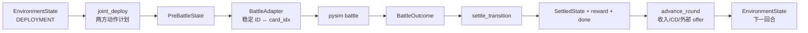

# Transition 实现任务书：玩家回放与随机策略 MVP

> 本文是 [`transition需要检验的指标.md`](transition需要检验的指标.md) 的施工版。
> 前者回答“transition 怎样才算正确”，本文回答“从当前仓库出发，下一段代码先写
> 什么、接口长什么样、每一步怎样验收”。长期 RL 方向见
> [`rl-roadmap.md`](rl-roadmap.md)，整体 milestones 见
> [`rl-development-plan.md`](rl-development-plan.md)。
>
> 本任务书中的复选框是实施状态，不是现状声明。只有对应测试和产物落地后才能勾选。

## 0. 本轮开发的两个终点

本轮不要以“已经有一个叫 `transition()` 的函数”为完成标准，而要以两个可直接运行
的程序为终点。

### 终点 A：用 pysim 反事实回放玩家对局

输入一条真实玩家回放：

1. 只在开始时从回放构造一次环境状态；
2. 后续每回合继续使用玩家在回放中实际做出的动作；
3. 候选增援等暂时无法自行生成的外生信息，可以由回放逐回合注入；
4. 战斗胜负、幸存价值、经验增量和扣血全部使用 `pysim` 的结果；
5. 绝不再用下一回合 XML 覆盖模拟中的 HP、经验或战斗结果；
6. 一直运行到一方 HP 归零、回放动作耗尽，或遇到明确记录的不支持机制。

建议最终命令：

```bash
python examples/replay_player_match.py \
  --rounds data/samples/rounds.json \
  --game 0 \
  --start-round 1 \
  --seed 7 \
  --strict
```

程序至少打印每回合：双方 action receipts、部署后 state digest、pysim winner、
`damage_to_player`、逐卡经验变化、HP、reward、done 和停止原因。

### 终点 B：随机合法策略可以跑完整 episode

环境能从固定 sandbox 或历史中间状态 `reset()`，两个 `RandomLegalPolicy` 只从合法
动作中采样，经 deployment → battle → settlement 连续运行到终局，并输出可复现的
trajectory。

建议最终命令：

```bash
python examples/random_rollout.py --episodes 1000 --seed 7
```

这 1,000 局必须满足：无 crash、hang、NaN、负资源、重复 entity ID、非法 phase、
终局后继续 step 或输入状态被原地修改。

### 0.1 三种运行模式必须分开

| 模式 | 每轮状态来源 | 战斗来源 | 用途 | 能否称连续环境 |
|---|---|---|---|---:|
| `oracle_check` | 每个 `state_i` 都来自 XML | 原始 `FightReport_i` | 验证 deploy/settlement 是否符合真实回放 | 否 |
| `pysim_human_replay` | 只初始化一次，之后由 transition 累积 | pysim | 用玩家动作在模拟规则下反事实重赛 | 是 |
| `random_rollout` | reset 后由 transition 累积 | pysim | 随机策略、RL smoke test | 是 |

`oracle_check` 中读取下一回合快照是为了比较 expected；另外两种模式中，下一回合快照
不得回写到环境。否则看起来“回放成功”，实际没有证明 transition 能连续运行。

## 1. 先冻结的 MVP 边界

第一版选择一个小而闭环的 ruleset，避免候选牌池、全部专家和稀有技能同时阻塞 RL。

### 1.1 v0 必须支持

- 固定游戏数据版本、Normal 1v1、固定地图坐标系；
- 从选定 `start_round` 的完整回放快照或固定 sandbox state 初始化；
- 稳定单位 `entity_id` 和 action-local `new_ref`；
- `BuyUnit`、`MoveUnit`、`UpgradeUnit`、`UnlockUnit`、
  `UpgradeTechnology`、`FinishDeploy`；
- 资金账本、单位购买/升级/移动、科技累计状态；
- `EnvironmentState -> pysim -> BattleOutcome`；
- 按 pysim outcome 更新 HP、`preRoundFightResult` 和单位经验；
- 回合推进、基础收入、终局、零和 reward；
- 外部注入下一回合候选/增援结果；
- strict 错误、legal mask、确定性、save/load；
- 玩家回放 runner 和 random legal runner。

### 1.2 可以在 v0 后补

- `ChooseAdvanceTeam` / `ChooseReinforceItem` 的完整效果；
- `UseEquipment`、`ActiveBlueprint`、`StrengthenTower`；
- 塔技能、指挥官技能、装置、建筑的全部外围状态变化；
- 完整 shop、候选 RNG、隐藏牌池和真实开局 `reset()`；
- 2v2、特殊模式、跨游戏版本 migration；
- Transformer 文本序列、tokenizer 和 token-level grammar。

v0 可以从 round 1 或任意完整的普通回合开始连续反事实回放。要从 round 0 空状态开始，
必须先补齐 `ChooseAdvanceTeam` 及其初始单位/专家/经济效果；不能通过读取 round 1 快照
假装该 action 已被 transition 执行。

后补不等于静默忽略。遇到未支持 action 或字段时必须返回稳定 reason code，并让该
回合进入 `unsupported` 桶。只有被当前 feature flag 声明支持的回合才计入正确率。

### 1.3 v0 的四条硬约束

1. **结构化 state 是真值**：transition 不在 XML dict 或 token 序列上直接运算；
2. **battle 是可替换 adapter**：外围环境不能读取 `Battle` 的私有 numpy 数组；
3. **非法动作不静默**：拒绝时不修改状态，并返回 reason code；
4. **每层只有一个写入者**：deploy 不改 HP，battle adapter 不改长期 state，
   settlement 不重新执行购买。

## 2. 完整回合的数据流



实现时保留以下纯函数边界：

```python
deploy_transition(
    state: EnvironmentState,
    plans: tuple[CanonicalActionPlan, CanonicalActionPlan],
    rules: Ruleset,
) -> DeployResult

battle_transition(
    pre_battle_state: EnvironmentState,
    battle_seed: int,
    engine: BattleEngine,
) -> BattleOutcome

settle_transition(
    pre_battle_state: EnvironmentState,
    outcome: BattleOutcome,
    rules: Ruleset,
) -> SettlementResult

advance_round(
    settled_state: EnvironmentState,
    next_offers: tuple[Offer, Offer] | None,
    rules: Ruleset,
) -> EnvironmentState
```

对外再组合成：

```python
env.step_joint(plan0, plan1, *, battle_seed=None) -> StepResult
```

`step_joint()` 是 RL/回放方便接口，不替代上述分层函数和分层测试。

## 3. 建议的代码布局

不要继续扩充 `tools/replay2json.py::build_units_fight()`，也不要把外围规则塞进
`pysim/engine.py`。建议新增：

```text
pysim/transition/
  __init__.py             公共类型与环境入口
  model.py                state/action/outcome dataclass 与 Enum
  codecs.py               replay level/坐标/枚举的边界转换
  errors.py               reason code 与 TransitionError
  state_tools.py          copy、canonical dict、digest、diff、不变量
  replay_adapter.py       rounds JSON/XML 语义 -> 结构化对象
  canonicalize.py         RawActionLog -> CanonicalActionPlan
  legality.py             validate + legal action candidates
  economy.py              价格、收入和 SupplyLedger
  deploy.py               apply_action / deploy_transition
  battle_adapter.py       EnvironmentState <-> pysim BattleOutcome
  settlement.py           HP、经验、result、reward、round tick
  env.py                  reset/observe/step_joint/save/load

pysim/policies/
  random_legal.py         只依赖公开 env 接口的随机策略

tests/transition/
  fixtures/               人工核对的小型 fixture；禁止放完整本地语料
  test_model.py
  test_replay_adapter.py
  test_canonicalize.py
  test_deploy_actions.py
  test_economy.py
  test_battle_adapter.py
  test_settlement.py
  test_env.py
  test_replay_runner.py
  test_random_rollout.py

tools/
  transition_action_census.py
  transition_replay_check.py

examples/
  replay_player_match.py
  random_rollout.py
```

如果初期觉得文件过多，可以先合并 `codecs.py`/`state_tools.py` 或
`legality.py`/`deploy.py`，但公共契约、battle adapter 和 environment 三层不要合并。

## 4. 第一版结构化契约

下面是实现方向，不要求逐字照抄；字段名一旦进入 fixture 和 trajectory 就必须版本化。

### 4.1 State

```python
class Phase(str, Enum):
    DEPLOYMENT = "deployment"
    PRE_BATTLE = "pre_battle"
    SETTLEMENT = "settlement"
    TERMINAL = "terminal"

@dataclass(frozen=True)
class UnitCard:
    entity_id: int             # 环境内部稳定 ID
    mech_id: int
    level: int                 # canonical: 1 基
    exp: int                   # 使用何种 pysim 量化规则见任务 T5.2
    x: float
    y: float
    is_rotate: bool
    equipment_id: int = 0
    sell_supply: int = 0
    replay_index: int | None = None  # 仅用于溯源，不进入模型观测

@dataclass(frozen=True)
class PlayerState:
    hp: int
    max_hp: int
    supply: int
    pre_round_fight_result: str | None
    units: tuple[UnitCard, ...]
    unlocked_mechs: frozenset[int]
    tech_map: tuple[tuple[int, tuple[int, ...]], ...]
    officers: tuple[int, ...]
    blueprints: tuple[int, ...]
    commander_skills: tuple[CommanderSkillState, ...]
    tower_strengthen: tuple[int, int]

@dataclass(frozen=True)
class EnvironmentState:
    schema_version: str
    ruleset_version: str
    engine_version: str
    round: int
    phase: Phase
    players: tuple[PlayerState, PlayerState]
    offers: tuple[Offer | None, Offer | None]
    next_entity_id: int
    env_rng_state: object | None
    terminal_reason: str | None
```

v0 尚未建模但必须保留的 XML 字段，放入显式 `pass_through` 或 provenance，不要散落在
任意 `dict`。只要一个字段会影响 action 合法性或战斗输入，就不能继续当
`pass_through`。

### 4.2 等级、经验和坐标边界

当前回放 XML 的 `Level` 是 0 基，`pysim.engine.Battle` 内部是 1 基，现有
`battle_from_units()` 会在边界执行 `+1`。新 transition state 统一使用 **1 基等级**：

```text
ReplayAdapter: raw Level + 1 -> UnitCard.level
BattleAdapter: UnitCard.level -> Battle.add_card(level=level)
旧 battle_from_units: 继续接收 replay-style 0 基 dict，保持兼容
```

禁止让 canonical state 经过旧 `battle_from_units()` 再被加一次。为这条边界单独写
level 1–4 的参数化测试。

坐标 v0 先保留 float，但 `canonical_dict()` 必须拒绝 NaN/Inf，并使用固定格式产生
digest。坐标格点化留到序列化阶段。

经验先在 T5.2 冻结一个明确的 `ExpSettlementPolicy`：输入为 pysim 原始卡级
`exp_before/exp_after`，输出为长期状态的整数 `exp_delta`。未冻结前不允许在多个地方
各写一套 `int()`/`round()`。

`max_hp` 不能拿当前 `reactorCore` 临时充当。ReplayAdapter 应从开局初始化状态、明确
ruleset 配置或已验证的回放字段取得；来源缺失时样本标记为 unsupported。sandbox 则把
初始/最大 HP 作为 `Ruleset` 的显式参数。

### 4.3 Action

```python
class ActionKind(str, Enum):
    BUY_UNIT = "buy_unit"
    MOVE_UNIT = "move_unit"
    UPGRADE_UNIT = "upgrade_unit"
    UNLOCK_UNIT = "unlock_unit"
    BUY_TECH = "buy_tech"
    END_DEPLOY = "end_deploy"

@dataclass(frozen=True)
class EntityRef:
    handle: int | None = None       # 当前 observation 中的局部 handle
    new_ref: int | None = None

@dataclass(frozen=True)
class ResolvedEntityRef:            # 只在 transition 内部出现
    entity_id: int

@dataclass(frozen=True)
class CanonicalAction:
    kind: ActionKind
    args: ActionArgs

@dataclass(frozen=True)
class CanonicalActionPlan:
    player: int
    actions: tuple[CanonicalAction, ...]
```

永久 `entity_id` 由 transition 从 `next_entity_id` 分配，但不暴露给 policy。
Observation 按规范顺序生成局部 `handle`，执行前由环境解析为 `ResolvedEntityRef`。
`BUY_UNIT ... as new_0` 后，本 plan 内动作可以引用 `new_0`；plan 结束后 `new_ref`
失效。ReplayAdapter 则把回放 `(player, unit Index)` 解析到同一内部 entity。

### 4.4 Receipt、错误和账本

每个原子动作都返回：

```python
@dataclass(frozen=True)
class ActionReceipt:
    action_index: int
    accepted: bool
    reason_code: str
    resource_delta: int
    created_entity_id: int | None
    changed_paths: tuple[str, ...]
    state_digest_after: str
```

v0 至少冻结这些 reason code：

```text
OK
WRONG_PHASE
UNSUPPORTED_ACTION
UNKNOWN_MECH
UNKNOWN_TECH
UNKNOWN_ENTITY
FUTURE_LOCAL_REF
DUPLICATE_LOCAL_REF
INSUFFICIENT_SUPPLY
MECH_NOT_UNLOCKED
TECH_ALREADY_OWNED
TECH_PREREQUISITE_MISSING
EXP_NOT_ENOUGH
MAX_LEVEL
POSITION_OUT_OF_BOUNDS
POSITION_OCCUPIED
PLAYER_ALREADY_FINISHED
ACTION_AFTER_END_DEPLOY
```

拒绝动作后 `state_digest_before == state_digest_after`。不要用异常表示正常的策略非法
动作；异常只用于 schema 损坏、未知 ruleset 或引擎内部错误。

资金变化同时写入 `SupplyLedger`：

```python
@dataclass(frozen=True)
class SupplyEntry:
    reason: str
    amount: int
    action_index: int | None
    entity_id: int | None
```

最终资金必须等于 `supply_before + sum(entries.amount)`。

### 4.5 BattleOutcome 和 StepResult

```python
@dataclass(frozen=True)
class CardBattleResult:
    entity_id: int
    exp_before: int
    exp_delta: int
    exp_after: int
    damage: float
    kills: int
    survived: bool

@dataclass(frozen=True)
class BattleOutcome:
    battle_seed: int
    winner: int                 # 0 / 1 / -1
    score_by_team: tuple[int, int]
    damage_to_player: tuple[int, int]
    cards: tuple[CardBattleResult, ...]
    end_time: float
    engine_version: str

@dataclass(frozen=True)
class StepResult:
    observation: tuple[Observation, Observation]
    reward: tuple[float, float]
    done: bool
    state: EnvironmentState
    deploy_receipts: tuple[tuple[ActionReceipt, ...], ...]
    battle_outcome: BattleOutcome
    state_digest: str
```

`damage_to_player[p]` 表示玩家 `p` 本回合被扣的血；不要让调用者猜测 score 属于哪一
方。`reward[0] + reward[1]` 必须精确为 0。

## 5. 逐步任务清单

每个任务都应独立提交。不要在一个提交中同时发明 schema、经济规则并接完整引擎。

### T0：冻结基线与证据索引

**目标**：写 transition 前先知道当前数据和测试基线是什么。

- [ ] 运行并保存 `pytest tests -q` 的基线结果；
- [ ] 运行 `python examples/replay_round.py data/samples/rounds.json 0 3`；
- [ ] 新增 `tools/transition_action_census.py`，统计 action type、字段、频率、回合数；
- [ ] 对本地全量语料运行 census，输出 JSON + Markdown，不把大语料提交进 Git；
- [ ] 为 16 类已见 raw action 建 registry；未知类型进入 `UNKNOWN_RAW_ACTION`；
- [ ] 给 ruleset、schema、engine、fixture 各定义版本字符串；
- [ ] 记录全量语料 hash、回放数、round 数和游戏版本分桶。

**建议测试**：

```bash
python tools/transition_action_census.py \
  --rounds data/samples/rounds.json \
  --out /tmp/transition_census.json
```

**完成 gate**：样例语料所有 action 都能进入 registry；census 遇到新类型时非零退出或
明确报告，不能跳过。

### T1：建立 model、codec、digest 和 state diff

**目标**：先让 state 可以被可靠表示和比较，不写任何游戏规则。

- [ ] 创建 `pysim/transition/` 包和 `model.py`；
- [ ] 使用 frozen dataclass 或等价不可变模型；
- [ ] 写 `ReplayLevelCodec`，固定 0 基 ↔ 1 基边界；
- [ ] 写坐标有限值检查和布尔/枚举解析；
- [ ] 写 `canonical_dict(state)`，集合和 map 使用稳定排序；
- [ ] 写 `state_digest(state)`；
- [ ] 写 `diff_state(expected, actual)`，返回第一个 divergence 和完整字段统计；
- [ ] 写 `assert_state_invariants(state)`；
- [ ] 验证 transition 工具不会修改输入对象。

**必须测试**：

- XML Level 0/1/2/3 分别变成 canonical 1/2/3/4；
- canonical level 进入 Battle 后仍是 1/2/3/4，不发生二次 `+1`；
- 单位输入顺序不同但语义相同时 digest 相同；
- 改变一个单位经验后，diff 精确定位到该 entity；
- NaN/Inf、重复 entity ID、错误 phase 被拒绝；
- `copy -> serialize structured -> load` 后完全相等。

**完成 gate**：样例语料的 state adapter round-trip 100%，相同 state 重复 digest 完全
一致。

### T2：ReplayAdapter 与人工 golden fixtures

**目标**：把 `tools/replay2json.py` 的松散 dict 限制在仓库边界。

- [ ] 实现 `ReplayAdapter.player_state(round_record)`；
- [ ] 实现 `ReplayAdapter.environment_state(game, round)`；
- [ ] 保留 replay file、player、round、raw Index、原始字段路径作为 provenance；
- [ ] 从下一回合快照构造 expected state 的逻辑只放在 oracle harness；
- [ ] 不把 `units_fight` 当作独立真值写进 state；
- [ ] 为每类核心 action 选一个最小真实片段，人工核对 before/action/after；
- [ ] fixture 中保存来源 replay hash 和 XML/JSON 定位；
- [ ] 完整快照中未建模字段显式登记为 `pass_through` 或 `unsupported`。

**注意**：现有 `build_units_fight()` 可以在开发初期作为诊断参考，但新 deploy
transition 的 expected 必须优先来自人工 fixture、下一状态和独立不变量，不能复制该
函数实现来“证明”自己。

**完成 gate**：从样例语料任意 round 都能构造结构化 state；不支持字段有计数和路径，
没有 KeyError/default 猜测。

### T3：RawActionLog、canonicalization 与引用系统

**目标**：能忠实解析 UI 动作，也能得到适合 transition/RL 的规范计划。

- [ ] Raw 层无损保存所有 action type、参数、Time、LocalTime 和 Undo/Cancel；
- [ ] 为 v0 六类 canonical action 定义 typed args；
- [ ] `MoveUnit` 中多个 `moveUnitDatas` 拆成确定顺序的原子动作；
- [ ] 连续移动同一单位折叠到最终位置；
- [ ] `Undo` 抵消它实际撤销的操作，不能永远假设只撤销最后一次购买；
- [ ] 被 Cancel 的技能不进入 canonical plan；
- [ ] 购买生成 `new_ref`，后续 Move 可以引用；
- [ ] observation handle 在当前 action plan 内唯一，并可解析到一个 stable entity；
- [ ] 规范顺序使用依赖图 + 稳定拓扑排序；
- [ ] `canon(canon(plan)) == canon(plan)`；
- [ ] unsupported raw action 保留在审计结果中并阻止 strict replay。

**必须测试**：

- Buy → Move 新单位；
- Buy → Undo；
- 同单位 Move × N；
- 两个相同兵种连续购买，各自被正确引用；
- 引用未来 `new_ref`、重复定义、跨 plan 使用均被拒绝；
- 顺序相关 action 不因 canonical sort 改变语义。

**完成 gate**：所有核心 golden fixture 都得到唯一 canonical plan；raw replay 和
canonical replay 的最终核心 board 字段一致。

### T4：核心 deployment transition

**目标**：实现第一个真正的状态转移层，只处理部署，不调用 battle。

推荐按以下小步依次实现：

#### T4.1 `MoveUnit` + `FinishDeploy`

- [ ] entity 必须存在且属于当前玩家；
- [ ] 检查 phase、坐标范围、部署区域、旋转值；
- [ ] 同一 action 中要么全部成功，要么定义并测试逐原子动作语义；
- [ ] `FinishDeploy` 后该玩家不能继续行动；
- [ ] 双方都结束后 phase 进入 `PRE_BATTLE`；
- [ ] 移动不改变 supply、HP、经验、科技和 entity ID。

#### T4.2 `BuyUnit`

- [ ] 检查兵种存在、已解锁、资源充足、位置合法；
- [ ] 从 `next_entity_id` 分配永久 ID；
- [ ] 将 `new_ref` 映射到永久 ID；
- [ ] 使用 gamedata 的购买价格并写 SupplyLedger；
- [ ] rejected buy 不消费 ID、不扣钱、不保留 local ref。

#### T4.3 `UnlockUnit`

- [ ] 检查是否已经解锁；
- [ ] 从 gamedata 读取 `unlock_price`；
- [ ] 原子地更新 unlocked set 和 supply；
- [ ] 价格来源缺失时返回 `UNSUPPORTED_RULE_DATA`，不能按 0 元处理。

#### T4.4 `UpgradeUnit`

- [ ] 检查 entity、等级上限和经验门槛；
- [ ] 冻结升级是否消费经验、消费多少 supply；
- [ ] 规则未确认前用 feature flag 隔离，不猜测；
- [ ] 升级只改允许字段，不能重建单位导致装备/位置丢失。

#### T4.5 `UpgradeTechnology`

- [ ] 检查 mech、tech、前置链、是否已购买和资金；
- [ ] 明确高阶科技是替换低阶还是累计；
- [ ] `tech_map` canonical sort；
- [ ] 与 `build_tech_map()` 的 battle 有效科技口径写交叉测试。

#### T4.6 联合执行、账本和 strict/masked/tolerant

- [ ] `apply_action()` 是 legality 和执行的唯一规则源；
- [ ] `validate_action()` 与执行不能复制两份会漂移的规则；
- [ ] strict：首个非法 action 抛出带上下文的 `TransitionError`；
- [ ] masked：策略只能取得当前合法候选；
- [ ] tolerant：返回 rejected receipt 和惩罚，但状态不变；
- [ ] 每个 action 后记录 digest 和 changed paths；
- [ ] plan 结束时验证 supply ledger 和 state invariants。

**完成 gate**：受支持 golden fixture 的单位集合、等级、位置、转向、科技、资金逐字段
exact；被拒动作 state digest 不变；没有 silent ignore。

### T5：扩充 pysim 的公开 BattleOutcome

**目标**：让 settlement 只消费公开、稳定、可版本化的 battle 结果。

- [ ] 在构建 Battle 时保存 `entity_id <-> card_idx` 双向映射；
- [ ] 新增 canonical-state 专用 `battle_from_state()`，避免等级二次转换；
- [ ] 保留现有 `battle_from_units()` 的行为和测试，防止 benchmark 回归；
- [ ] 扩充公开结果：双方 score、被扣血、逐 entity 经验前后值、伤害、击杀、存活；
- [ ] adapter 返回 `BattleOutcome`，外部不读取 `b.cards`、`b._score_val` 等私有字段；
- [ ] 将 `engine_version`、battle seed 和关键 opts digest 写进 outcome；
- [ ] 同输入 + 同 seed 得到相同 outcome digest。

#### T5.1 冻结 pysim 扣血规则 v1

现有引擎已经计算每个存活模块的：

```text
模块价值 = card.base_money / mech_count × level
存活分数 = 模块价值 × remaining_hp / max_hp
```

v0 可以先把 `score_by_team` 定义为普通存活战斗单位的上述分数之和取整；胜方的 score
成为败方 `damage_to_player`，平局双方为 0。这个规则必须命名，例如
`pysim_survivor_value_v1`，并写进 ruleset/trajectory。它是 **pysim 环境规则**，不是
宣称已经 100% 复刻真实 `FightReport.Score`。

正式冻结前完成三个探针：

- [ ] 与真实 `FightReport.Score` 比较分布、相关性和极端值；
- [ ] 确认塔、建筑、装置、召唤单位是否计分；
- [ ] 确认超时双方仍有存活单位时只由 winner 造成伤害，还是双方都造成伤害。

若探针否定候选公式，替换公式但保留同一接口并提升 damage rule version。

#### T5.2 冻结 pysim 经验规则 v1

- [ ] outcome 同时返回引擎原始 exp 和量化后的长期 exp；
- [ ] 为参与击杀分数产生的小数定义唯一量化位置；
- [ ] 明确经验满后是否截断，battle 内是否允许自动升级；
- [ ] 逐 entity 校验 `after = before + delta`；
- [ ] 找不到 entity 或一个 card_idx 映射多个 entity 时立即失败。

**完成 gate**：`BattleOutcome` 足以完成 settlement；旧 benchmark/test 行为不回归；
外围环境不访问 Battle 私有数组。

### T6：Settlement、reward 与 advance_round

**目标**：把 battle 结果变成下一回合长期状态。

- [ ] `hp_next[p] = max(0, hp_before[p] - damage_to_player[p])`；
- [ ] 从各自视角写 `Win/Lose/Draw`；
- [ ] 按 entity 回写经验；
- [ ] 普通战斗死亡单位仍保留在长期 `units`；
- [ ] battle influence 白名单外字段保持不变；
- [ ] HP 归零后进入 TERMINAL，终局后不可 advance/step；
- [ ] reward 输出 damage、terminal、invalid-action 三个分量；
- [ ] 验证 `reward[0] == -reward[1]`；
- [ ] `advance_round()` 统一处理 round +1、基础收入、CD tick、offer 注入；
- [ ] 收入和 CD 规则都由 `Ruleset` 提供，不在 env 中写魔法数字。

v0 若完整收入规则尚未确认，可以使用显式的 `sandbox_ruleset_v0`：固定每回合收入、
固定候选或无候选。它必须与 `normal_1v1_replay_vX` 分开命名，不能把 sandbox 数值冒充
真实规则。

**必须测试**：

- win/lose/draw/terminal；
- HP 恰好归零与超过剩余 HP；
- 败方单位仍保留；
- 改变 battle outcome 后只有白名单字段变化；
- 双方交换 + 坐标镜像后 outcome/state/reward 对称；
- 原始 state 未被修改。

**完成 gate**：oracle eligible round 的 HP/result 在真实 FightReport 模式下 exact；
pysim outcome 模式能产生自洽的 next state。

### T7：Environment API 与合法动作生成

**目标**：形成可被回放 runner 和 RL 共用的最小环境。

建议公开：

```python
env.reset(config_or_state, seed) -> tuple[Observation, Observation]
env.observe(player) -> Observation
env.legal_action_candidates(player) -> Sequence[CanonicalAction]
env.apply_player_action(player, action) -> ActionReceipt
env.step_joint(plan0, plan1, battle_seed=None) -> StepResult
env.save() -> bytes | dict
env.load(snapshot) -> None
```

- [ ] `step_joint()` 保证双方动作只修改各自允许的 state；
- [ ] 双方都 Finish 后只执行一次 battle；
- [ ] `legal_action_candidates()` 与 `apply_action()` 共用规则源；
- [ ] 返回给 policy 的 action 只含 observation handle/new_ref，不泄漏内部 entity ID；
- [ ] action prefix 每变化一次就能重新取得 mask/candidates；
- [ ] 给每回合和每 episode 设置最大 action 数，防止无限移动；
- [ ] observation 明确剔除 env RNG、内部 entity ID 和隐藏信息；
- [ ] player 1 坐标镜像由一个可逆 codec 完成；
- [ ] save/load 保存 state、RNG、版本、当前 phase 和已结束部署标记；
- [ ] save/load 后继续 rollout 与不中断完全相同。

第一版不必强行依赖 Gymnasium。先把语义稳定为项目自己的 typed API；需要接
Gymnasium/PettingZoo 时再写薄 wrapper。

**完成 gate**：同 seed + 同 joint plans 的完整 trajectory digest 相同；mask 和执行的
接受/拒绝一致率 100%。

### T8：真实 transition 的 oracle 对拍工具

**目标**：持续回答“外围 transition 哪里先错了”。

建议命令：

```bash
python tools/transition_replay_check.py \
  --rounds data/samples/rounds.json \
  --mode oracle \
  --report /tmp/transition_report.json
```

- [ ] 每个样本构造 `state_i + raw_actions_i + FightReport_i -> predicted state_(i+1)`；
- [ ] 同时报告 deployment、settlement、end-to-end 三层结果；
- [ ] 记录 first divergent action/path；
- [ ] 报告 action type coverage、occurrence coverage、fully-supported round/replay rate；
- [ ] 报告 exclusion reason 数量和占比；
- [ ] JSON 报告包含版本、Git commit、corpus hash 和 representative fixtures；
- [ ] full corpus 是 slow/local test，仓库样例是 quick CI test；
- [ ] 不允许看到 diff 后临时排除样本；排除只能来自预定义 reason code。

**完成 gate**：受支持样本的 modeled 字段 exact 100%；正确率与覆盖率分开显示。

### T9：pysim 玩家反事实回放 runner

**目标**：完成终点 A，并证明不是每轮重灌 XML 快照。

实现 `HumanReplayPolicy`：按 round/player 提供原始玩家动作，经 canonicalizer 后交给
同一个 env API。

- [ ] 只从选定起始 round 初始化一次 state；
- [ ] 后续 mutable state 仅来自上一回合 transition；
- [ ] 每回合可以从 replay 注入 offer/外生事件，但注入项要单独列入日志；
- [ ] 玩家动作通过 strict transition 执行；
- [ ] 战斗只调用 pysim，不读取真实 label/FightReport 决定 winner/HP/exp；
- [ ] 不读取下一 round 的 HP/exp/supply 来修正模拟 state；
- [ ] 若历史动作因反事实经验或经济变得非法，停止或明确 rejected，不能偷偷修补；
- [ ] 输出真实回放结果与 pysim 结果的对照只用于观测，不参与状态更新；
- [ ] trajectory 保存初始 state、每轮计划、seed、receipts、outcome、reward 和 digest；
- [ ] 支持从保存点继续。

建议提供两种策略：

```text
--strict       任一非法/unsupported action 立即停止，适合开发和 gate
--tolerant     记录拒绝并继续，适合统计全量反事实回放可运行率
```

tolerant 模式不得算作 exact transition 通过，也不能作为 RL 默认模式。

**完成 gate**：仓库内至少一条选择好的 supported sample replay 能连续跑到回放动作结束
或 pysim 提前终局；日志能证明后续 HP/经验来自 pysim，而非 XML 快照覆盖。

### T10：RandomLegalPolicy 与随机 episode

**目标**：完成终点 B，给 RL 一个可以立刻调用的最小闭环。

Random policy 必须只依赖：

```text
observe(player)
legal_action_candidates(player)
apply_player_action(player, action)
```

不能读取内部 EnvironmentState、对手隐藏信息或 Battle 私有数组。

- [ ] 提供 `ReplayStateResetter`：从历史部署前状态采样起点；
- [ ] 提供 `SandboxResetter`：固定开局、固定收入/候选；
- [ ] policy 在合法动作中随机采样，并以可配置概率 Finish；
- [ ] 每个单位每回合移动/升级次数和总 action budget 有上限；
- [ ] 无可买/升/移时必定 Finish，不能死循环；
- [ ] seed 拆分为 env/deploy/battle/policy 子流并写 trajectory；
- [ ] 单局 smoke test；
- [ ] 100 局 quick fuzz；
- [ ] 1,000 局 slow soak；
- [ ] 汇总 episode 长度、round 数、action 接受率、结束原因、reward、HP、状态异常。

**完成 gate**：1,000 局全部自然结束或命中明确 max-round；无 silent rejection 和状态
不变量失败；固定 seed 可逐步复现。

### T11：测试分层、文档与 CI

**目标**：让 transition 后续扩机制时不会把已有闭环打坏。

建议测试分层：

```text
unit       单个 codec、action、经济和 settlement 规则；每次提交运行
golden     人工 fixture 的 before/action/after；每次提交运行
sample     data/samples/rounds.json；CI 运行
property   随机 state/action 不变量；CI 可缩小规模运行
full       local_data 全量回放；本地或定时运行
soak       1,000+ episode；定时运行
```

- [ ] 给 slow/full/soak 测试添加 pytest marker；
- [ ] README 增加玩家回放和 random rollout 命令；
- [ ] 每次 trajectory/report 绑定 schema/ruleset/engine/git commit；
- [ ] 保存首个失败 fixture，不保存整份 300MB 语料；
- [ ] `git diff --check` 和全量现有引擎测试通过；
- [ ] engine 输出扩展保持向后兼容；
- [ ] 将完成情况同步回本文复选框和验收文档的 G0–G3。

## 6. 推荐的提交顺序

按下面顺序做，每个提交都应保持 `pytest tests -q` 可运行：

1. `transition: scaffold typed state and versioned codecs`
2. `transition: add canonical digest diff and invariants`
3. `transition: adapt replay states and add golden fixtures`
4. `transition: parse and canonicalize core replay actions`
5. `transition: execute move finish and entity references`
6. `transition: execute buy unlock upgrade and supply ledger`
7. `transition: execute technology actions and legality candidates`
8. `battle: expose stable entity outcomes score and exp`
9. `transition: add settlement reward and round advance`
10. `env: add deterministic joint step save and load`
11. `replay: add oracle transition checker`
12. `replay: add pysim human match runner`
13. `policy: add random legal rollout and soak tests`

若某一步因为规则未知而停住，先将该规则变成版本化 feature flag/unsupported reason，
继续完成闭环；不要在核心函数中写一个“暂时按 0 元/默认合法”的分支。

## 7. 开发过程中每天看的指标

### 7.1 Deployment dashboard

```text
action_type_coverage
action_occurrence_coverage
fully_supported_round_rate
accepted_replay_action_rate
unit_set_exact_rate
full_unit_card_exact_rate
supply_exact_rate
first_divergence_by_action_and_reason
silent_ignore_count = 0
```

### 7.2 Settlement dashboard

```text
hp_exact_rate (oracle mode)
fight_result_exact_rate (oracle mode)
exp_entity_exact_rate (oracle mode)
battle_whitelist_violation_count = 0
unknown_entity_mapping_count = 0
reward_zero_sum_violation_count = 0
```

### 7.3 Environment dashboard

```text
episode_count
complete_episode_rate
mean_rounds / max_rounds
rejected_action_rate by reason
state_invariant_failures = 0
determinism_failures = 0
save_load_failures = 0
NaN/Inf count = 0
```

任何百分比都同时显示分子/分母。受支持样本要求确定性外围字段 100% exact；95% 只可
作为覆盖率目标，不能作为正确率目标。

## 8. 两个 MVP 的最终验收脚本

### 8.1 玩家回放验收

```bash
# 真实 transition 分层对拍
python tools/transition_replay_check.py \
  --rounds data/samples/rounds.json \
  --mode oracle \
  --strict

# 玩家动作 + pysim 战斗的连续反事实回放
python examples/replay_player_match.py \
  --rounds data/samples/rounds.json \
  --game 0 \
  --start-round 1 \
  --strict \
  --trajectory /tmp/replay_player_match.json

# 固定输入复跑，trajectory digest 必须一致
python examples/replay_player_match.py \
  --rounds data/samples/rounds.json \
  --game 0 \
  --start-round 1 \
  --strict \
  --trajectory /tmp/replay_player_match_2.json
```

验收问题：

- [ ] 是否只初始化一次 mutable state？
- [ ] 后续 HP/经验是否确实来自 pysim outcome？
- [ ] 每个玩家 action 是否都有 receipt？
- [ ] 非法/不支持 action 是否明确中止或记录？
- [ ] 能否从任意保存点复现后续 trajectory？

### 8.2 随机策略验收

```bash
python examples/random_rollout.py \
  --episodes 1000 \
  --seed 7 \
  --report /tmp/random_rollout_report.json
```

验收问题：

- [ ] 策略是否只从 legal candidates 采样？
- [ ] 是否所有 episode 都终止或命中显式 max-round？
- [ ] 是否存在 rejected action、负资源、重复 ID、NaN 或 phase 错乱？
- [ ] `r0 + r1` 是否始终为 0？
- [ ] 相同 seed 的 episode digest 是否一致？

## 9. 何时可以开始 RL 实验

不需要等所有真实游戏外围规则完成。以下条件同时满足，就可以开始随机策略、启发式
策略和 RL pipeline 的最小实验：

- [ ] `EnvironmentState`、`CanonicalAction`、`BattleOutcome` 已版本化；
- [ ] 一个显式命名的 sandbox ruleset 能从 reset 连续打到终局；
- [ ] legal candidates 与 transition 接受/拒绝一致；
- [ ] pysim outcome 能稳定回写 HP 和逐 entity 经验；
- [ ] reward 零和且可分解；
- [ ] save/load 和 seed 确定性通过；
- [ ] RandomLegalPolicy 1,000 局 soak 无状态错误；
- [ ] trajectory 含 observation、action、receipt、reward、done、版本和 seed；
- [ ] 玩家反事实回放至少有一条连续 supported 示例；
- [ ] 真实回放对拍工具能持续衡量外围规则覆盖率。

达到这里的名字应是 **RL environment MVP / transition v0**，不是“完整复刻 Normal
1v1”。之后按 action occurrence 和 fully-supported round 的收益排序，逐步加入增援、
装备、蓝图、塔、指挥官技能和候选 RNG；每加入一类机制，都同时补 legality、执行、
golden fixture、oracle 指标和 random property test。

## 10. 当前第一步

真正开始编码时，先只做下面四件事：

1. 建 `pysim/transition/model.py`，冻结 1 基 level、stable entity ID、phase 和版本字段；
2. 建 `replay_adapter.py`，把一个 sample round 转成 `EnvironmentState`；
3. 建 `state_tools.py`，让这个 state 可 digest、diff、检查不变量；
4. 用一个真实 `MoveUnit` fixture 写第一个 failing test。

第一个实现 PR/提交的验收不是“能打一场”，而是：**能够清楚表示一个部署前状态，
能够无歧义指向某个单位，并能准确描述 Move 前后只有哪些字段发生了变化。** 这块稳定
后，再按 T3 → T4 → T5 的顺序接 action、经济和 battle。
